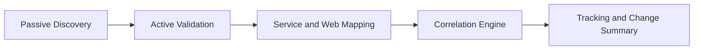
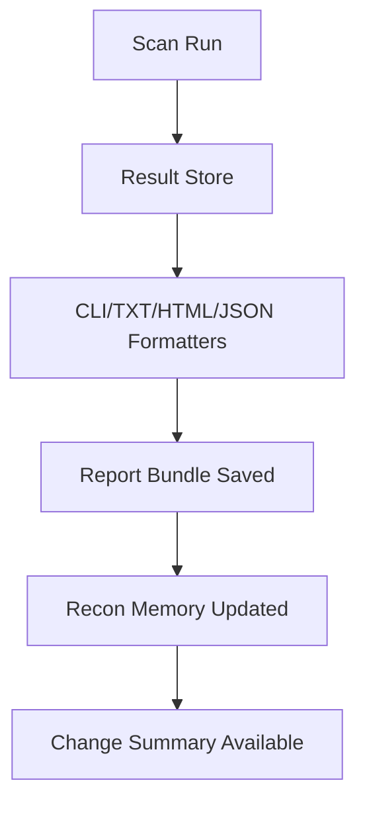

# ASRFacet-Rb 

<p align="center">
  
</p>

<p align="center">
  
  
  
  <br>
  
  
  
  <br>
  <a href="https://github.com/voltsparx/ASRFacet-Rb/actions/workflows/ci.yml"></a>
  <a href="https://github.com/voltsparx/ASRFacet-Rb/actions/workflows/pages.yml"></a>
</p>

ASRFacet-Rb is a Ruby 3.2+ framework for authorized attack surface reconnaissance.  
It is built for repeatable workflows, relationship-aware intelligence, and run-to-run change tracking, not one-off scanner output.

Project website: [https://voltsparx.github.io/ASRFacet-Rb/](https://voltsparx.github.io/ASRFacet-Rb/)

## Quick Navigation

- [What It Solves](#what-it-solves)
- [Architecture and Process Flow](#architecture-and-process-flow)
- [Installation Guide](#installation-guide)
- [Usage Guide with Examples](#usage-guide-with-examples)
- [Output, Storage, and Reporting](#output-storage-and-reporting)
- [Transparency and Operator Expectations](#transparency-and-operator-expectations)
- [Testing and Release Verification](#testing-and-release-verification)
- [Troubleshooting Guide](#troubleshooting-guide)
- [Reverse Engineering Notes](#reverse-engineering-notes)
- [Documentation Map](#documentation-map)

## What It Solves

Most recon tools are optimized for snapshots. That often creates:

- Scattered results across separate tools and files
- Weak run-to-run comparability
- Lost relationships between hosts, IPs, ports, services, and findings

ASRFacet-Rb addresses this with pipeline stages, memory-backed tracking, and structured output.

## Architecture and Process Flow

### Execution Roles

| Layer | Responsibility |
|---|---|
| Scheduler | Decides what runs next |
| Engines | Execute bounded tasks |
| Investigator | Reacts to significant findings |
| Fusion/Store | Persists and correlates results |

### Pipeline Visualization



### Stage Intent

| Stage | Main Outcome |
|---|---|
| Passive Discovery | Candidate assets from low-noise sources |
| Active Validation | Confirmed hosts, IPs, open ports, and HTTP surfaces |
| Service/Web Mapping | Reachable application/service context |
| Correlation Engine | Relationship mapping and prioritization |
| Tracking Engine | Delta detection and historical visibility |

## Installation Guide

### Requirements

- Ruby `>= 3.2`
- Bundler
- Explicit permission to test targets

### Installation Paths at a Glance

| Path | Use Case |
|---|---|
| `bundle exec` from repo | Development and contribution |
| `install/*.sh` / `install/windows.ps1` | Managed local system install |
| Website installers (`docs/website/web_assets/installers`) | Download-first install flow |

### 30-Second Quick Start (Repo Mode)

```bash
git clone https://github.com/voltsparx/ASRFacet-Rb.git
cd ASRFacet-Rb
bundle install
bundle exec rake
bundle exec ruby bin/asrfacet-rb scan example.com --passive-only
```

### Managed Installer Modes

| Mode | Description |
|---|---|
| `install` | Install framework and launchers |
| `test` | Repo-local smoke install |
| `update` | Refresh managed install |
| `uninstall` | Remove managed install and launchers |

Installed command aliases:

- `asrfacet-rb`
- `asrfrb`

### Docker Quick Start

The container assets live under [`docker/`](/c:/Users/lenovo/Documents/GitHub/ASRFacet-Rb/docker/README.md:1).

```bash
./docker/run-docker.sh --action up --rebuild --detach
./docker/run-docker.sh --action cli --command "scan example.com --passive-only"
```

```powershell
.\docker\run-docker.ps1 -Action up -Rebuild -Detach
.\docker\run-docker.ps1 -Action cli -Command "scan example.com --passive-only"
```

If you run a wrapper without arguments, it falls back to an interactive prompt mode.

Installer prompt theme:

- `[ASRFacet-Rb][INFO]`
- `[ASRFacet-Rb][ OK ]`
- `[ASRFacet-Rb][WARN]`
- `[ASRFacet-Rb][FAIL]`

## Usage Guide with Examples

### Core Commands

| Command | Purpose | Example |
|---|---|---|
| `scan DOMAIN` | Full pipeline | `asrfacet-rb scan example.com` |
| `passive DOMAIN` | Passive-only discovery | `asrfacet-rb passive example.com` |
| `ports HOST` | Focused port validation | `asrfacet-rb ports api.example.com --ports top1000` |
| `dns DOMAIN` | DNS-focused collection | `asrfacet-rb dns example.com` |
| `deploy` | Start the web UI and local lab together | `asrfacet-rb deploy` |
| `--console` | Interactive shell mode | `asrfacet-rb --console` |
| `--web-session` | Local web control panel | `asrfacet-rb --web-session` |
| `--version` | Print installed version | `asrfacet-rb --version` |
| `about` | Framework overview | `asrfacet-rb about` |
| `--explain TOPIC` | Built-in topic guidance | `asrfacet-rb --explain scope` |

### Guided Workflow 1: Passive First

```bash
asrfacet-rb passive example.com --format json --output passive.json
asrfacet-rb dns example.com
asrfacet-rb ports example.com --ports top100
```

When to use: low-noise recon kickoff with manual expansion.

### Guided Workflow 2: Full Report Bundle

```bash
asrfacet-rb scan example.com --monitor --memory --format html --output report.html
```

When to use: recurring assessments where historical deltas matter.

### Guided Workflow 3: Web Session and Operator UX

```bash
asrfacet-rb --web-session
```

When to use: visual control panel flow for recon, mapping, and report access.

### Guided Workflow 4: One-Go Local Deployment

```bash
asrfacet-rb deploy
asrfacet-rb deploy --public --web-port 8080 --lab-port 9393
```

When to use: bring up the full local operator surface in one command with health endpoints and a runtime manifest.

### Scanner Privileges

`connect`, `udp`, and `service` scans work without raw-socket privileges.  
Raw-style TCP modes such as `syn`, `ack`, `fin`, `null`, `xmas`, `window`, and `maimon` need both:

- elevated privileges such as `sudo` or an Administrator shell
- a real raw-capable TCP probe backend such as `nping`

ASRFacet-Rb now supports `nping` as the raw TCP backend across Linux, macOS, and Windows.

- Linux and macOS: install `nping`, then use `--raw-backend nping --sudo`
- Windows: install `nping` with `Npcap`, then run from an elevated Administrator shell or use `--sudo` so the CLI can request elevation

Example:

```bash
asrfacet-rb portscan 192.0.2.10 --type xmas --raw-backend nping --sudo
```

## Output, Storage, and Reporting

### Output Formats

| Format | Best For |
|---|---|
| `cli` | Live operator feedback |
| `txt` | Plain-text sharing |
| `html` | Human-friendly reports with richer structure |
| `json` | Automation and downstream tooling |

### Storage Layout

| Path | Data |
|---|---|
| `~/.asrfacet_rb/output/` | Report bundles and streams |
| `~/.asrfacet_rb/memory/` | Recon memory and deltas |
| `~/.asrfacet_rb/web_sessions/` | Saved web session state |
| `~/.asrfacet_rb/runtime/` | Deployment manifest and runtime metadata |

### Reporting Process Visualization



## Transparency and Operator Expectations

ASRFacet-Rb is meant to be inspectable and explicit about what it is doing.

- Active modes make real DNS, TCP, HTTP, and related network requests to the configured target scope.
- Passive results come from external sources and may be incomplete, stale, or include shared infrastructure that is not automatically authorized.
- The local web session starts a local HTTP server and stores persistent drafts under `~/.asrfacet_rb/web_sessions/`.
- Report bundles, event streams, and recon memory are written under `~/.asrfacet_rb/output/` and `~/.asrfacet_rb/memory/`.
- Findings and prioritization are operator aids, not proof of exploitability or ownership.
- The framework does not claim stealth, evasion, or guaranteed completeness.
- Scope control remains the operator's responsibility. Use `--scope` and `--exclude` before active runs.

Manual surfaces:

- `asrfacet-rb manual`
- `asrfacet-rb manual workflow`
- `man asrfacet-rb`
- `man asrfrb`

## Testing and Release Verification

```bash
bundle exec rake
bundle exec rake spec
bundle exec rake test:cli
bundle exec rake test:web
bundle exec rake test:lab
bundle exec rake test:deploy
bundle exec rake test:install
bundle exec rake test:website_installers
```

Verification snapshot:

- Date: `2026-04-27`
- Result: `241 examples, 0 failures`
- Full verify gate: `bundle exec rake` passed
- Version alignment gate: `bundle exec rake test:version` passed for `2.0.0`

## Troubleshooting Guide

| Symptom | Likely Cause | Quick Fix |
|---|---|---|
| `bundle` command missing | Bundler not installed | `gem install bundler` |
| Installer exits on permission/path | Existing unmanaged target path | Remove/rename conflicting path or use managed location |
| Noisy or slow run | Too many threads or broad scope | Lower `--threads`, tighten `--scope`, use passive-first flow |
| Report confusion | Multiple formats generated | Start with `report.html` then inspect `report.json` for automation |
| Web mode not reachable | Host/port mismatch | Start with `--web-host 127.0.0.1 --web-port 4567` and retry |
| Deploy stack does not come ready | Port already in use or service startup failure | Check `~/.asrfacet_rb/runtime/deploy.json`, then retry with different `--web-port` or `--lab-port` |

## Trust Signals

- Version file: [`VERSION`](/VERSION)
- Changelog: [`CHANGELOG.md`](/CHANGELOG.md)
- Roadmap: [`ROADMAP.md`](/ROADMAP.md)
- Website docs: [https://voltsparx.github.io/ASRFacet-Rb/](https://voltsparx.github.io/ASRFacet-Rb/)

## Documentation Map

- [`docs/getting-started.md`](/docs/getting-started.md)
- [`docs/architecture.md`](/docs/architecture.md)
- [`docs/web-session.md`](/docs/web-session.md)
- [`docs/reporting.md`](/docs/reporting.md)
- [`docs/lab.md`](/docs/lab.md)
- [`docs/publishing.md`](/docs/publishing.md)

## Authorized Use

Use ASRFacet-Rb only on systems you own or have explicit written permission to test.

## License

Proprietary custom license. See [`LICENSE`](/LICENSE).

## Author

- Handle: `voltsparx`
- Email: `voltsparx@gmail.com`
- Repository: [https://github.com/voltsparx/ASRFacet-Rb](https://github.com/voltsparx/ASRFacet-Rb)
